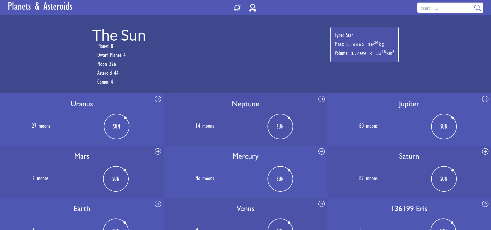

# MV-Module2-capstone

> **Planètes-et-astéroïdes** is a web app powered by the [The solar system API](https://api.le-systeme-solaire.net/en/) that displays metrics relative to the planets, satellites, and asteroids that constitute our solar system. In addition to the ability to navigate between the different celestial bodies, it also offers a powerful _search by name_ functionality. It is made as capstone project of the React&Redux module.

## Built With

- TailwindCss
- React
- Redux
- Redux-thunk
- React-router
- Redux-logger (tooling)
- React testing library (unit testing)
- The solar system API

## Milestones

- [x] Milestone 1: **React app setup with redux using the duck pattern**
- [x] Milestone 2: **Set up the app navigation using react-router**
- [x] Milestone 3: **Create an API layer using the Solar System API**
- [x] Milestone 4: **Create the Redux store including the action creators and the reducers**
- [x] Milestone 5: **Integrate the redux store into the app and display the data in the Home route**
- [x] Milestone 6: **Implement Details route functionalities**
- [x] Milestone 7: **Implement Search route and functionality**
- [x] Milestone 8: **Create the About route**
- [x] Milestone 9: **Finalize the styling**
- [x] Milestone 10: **Implement additional tests**

## sneak peek

## Getting Started

**Prerequisites:** A Web Browser (preferably FireFox or Chrome)

### **Option 1**

#### Use the live Website

[Live link](https://planetes-et-asteroides.netlify.app/)

### **Option 2**

#### Set up your own copy locally

- Clone [the GitHub Repository](https://github.com/Sboursen/planetes-et-asteroides)
- Go to the Project folder `cd planetes-et-asteroides`
- Run `npm install` to install the _dependencies_
- Run `npm start` to run the live server.

#### (Optional) Run tests

- Stop the server if it's already running `CTRL` + `C`
- Run `npm test` run the tests

## About the authors

👤 **Soufiane Boursen**

- GitHub: [@Sboursen](https://github.com/Sboursen)
- Twitter: [@sboursen_dev](https://twitter.com/sboursen_dev)
- LinkedIn: [@sboursen](https://linkedin.com/in/sboursen)

## Contributors

Contributions, issues, and feature requests are welcome!

Feel free to check the [issues page](../../issues/).

## Show your support

Give a ⭐️ if you like this project!

## Acknowledgments

- [Solar System API](https://api.le-systeme-solaire.net/en/)
- [Original Design](<https://www.behance.net/gallery/31579789/Ballhead-App-(Free-PSDs)>) by [Nelson Sakwa](https://www.behance.net/sakwadesignstudio)
- [NoMatch GIF](https://giphy.com/gifs/epitaphrecords-music-video-3o7btZ3T6y3JTmjg4w) from GIFFY.

## 📝 License

This project is [MIT](./LICENSE) licensed.
